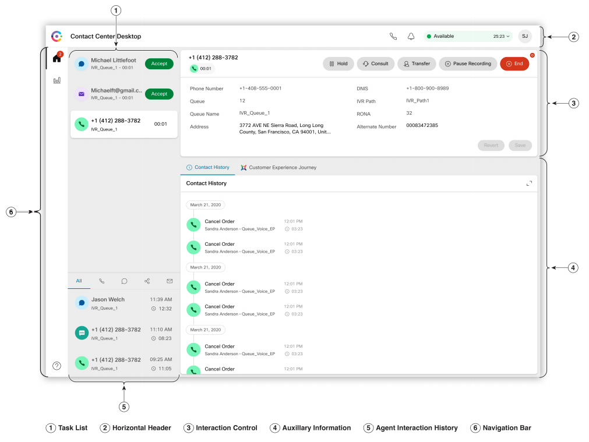

### Overview of the lab:
In this Lab, we will explore the different sections and some useful options of the Agent Desktop. You will watch a demo video about Agent Desktop overview and you will configure some options by following the described steps. At the end of the lab, you should be able to know where to find the different features and customize your own desktop layout.

# Table of Contents

- [1. Access to the Agent Desktop](#1-access-to-the-agent-desktop)
- [2. Agent Desktop Overview](#2-agent-desktop-overview)
- [3. Configure the User Profile](#3-configure-the-user-profile)
- [4. Custom Desktop Layout](#4-custom-desktop-layout)

# Introduction

## Lab Objective

The objective of this lab is to **explore the New Agent Desktop**, in order to be familiar with the its new structure, learn about recently released features and be able to configure basic options.

## Pre-requisites

- For doing this lab, you must first **complete the [Lab 1: Control Hub and Admin Portal](lab2.md)**;
- You have the administrator's access to the Tenant Portal;
- Agent created and configured;
- Agent is part of 2 Teams;
- Webex Calling extensions are assigned to a WxCC user:

# Lab Section

## Part 1: Access to the Agent Desktop

<iframe width="560" height="315" src="https://youtu.be/4aKajHZeuLo" frameborder="0" allow="accelerometer; autoplay; clipboard-write; encrypted-media; gyroscope; picture-in-picture" allowfullscreen></iframe>

- Navigate to **[https://desktop.wxcc-us1.cisco.com/](https://desktop.wxcc-us1.cisco.com/)** in a new browser tab
- Enter the agent’s **Username** which you created in the previous lab.
- Enter the **Password** for the appropriate Username
- In the Station Login pane, select **"Extension"** and input the configured number for that user. 
**Note** Please use only Extension for this lab
- Select the **Team_wxcclab**_<**your name or company name>**, with default layout. 
- Click **_Submit_**
			
If you are successfully logged in the Agent Desktop you have completed this section and you can continue with the next part!

## Part 2: Agent Desktop Overview

* The Agent Desktop is divided in 6 sections: **Task List, Horizontal Header, Interaction Control, Auxiliary Information, Agent Interaction History and Navigation bar**. In *Image 1* you can see a general view of the Agent Desktop and where each section is located.

Image 1

* **Watch the following video**, where each of the sections and their main options are explained. You will get a better idea of how the Agent Desktop look like and how to use it.

<iframe width="560" height="315" src="https://www.youtube.com/watch?v=6PhY8Wl_8Rw" frameborder="0" allow="accelerometer; autoplay; clipboard-write; encrypted-media; gyroscope; picture-in-picture" allowfullscreen></iframe>

* Then, try to spend little time to **play and explore the Agent Desktop**.

* Finally, in order to make sure that you have understood the basic concepts, we ask you to **complete the following tasks**:
   - **Verify that Agent can see reports**
   - **Download the Agent Dekstop User Guide**

 

## Part 3: Configure the User Profile

### 1. Change Notifications setting and volume
- Scroll down to **_User Settings_**
- Click on **_Notification Settings_**
- **Toggle** any of the 3 options to **enable or disable** different notifications
- Move the **Sound Volume** toggle bar
- You'll test this in the next lab.
- Check this when you receive a notification
		
### 2. Switch to Dark Mode
- Go again under **_User Settings_**
- Toggle the **_Switch to Dark Mode_** button to enable or disable it
		
### 3. See the list of the keyboard shortcuts
- Scroll down to **_Help_**
- Click on **_Keyboard Shortcuts_** or press **Ctrl+Alt+F**
- **See the list** of the keyboard shortcuts
- Find and test the combination to make the Agent status **_'Available'_**
		
### 4. Download Error Report
- Scroll down to **_Help_**
- Click on **_Keyboard Shortcuts_** or press **Ctrl+Shift+2**
- Find the downloaded **error reports** file in your machine

## Part 4: Custom Desktop Layout

### 1. Download default desktop Layout
- Login to **[https://portal.wxcc-us1.cisco.com](https://portal.wxcc-us1.cisco.com)** with admin credentials​
- Navigate to **_Provisioning_** –> _**Desktop Layout**_​
- Click on ellipses **(…)** of Global Layout and select **_Edit_** ​
- Click on **_Download_** button to download the **Default Desktop Layout.json** file

### 2. Customize default desktop layout with logo and title
- Open the **Default Desktop Layout.json** file with any text editor (e.g. Notepad or Sublime text)​
- Modify the **_appTitle_** key value with your company name in order to change Agent Desktop tittle
- Modify the **_logo_** key value with your company logo URL or use this CiscoLive logo url: **https://ayankovs-ccp-s3.s3.eu-west-3.amazonaws.com/CiscoLiveLogo.jpg**
- **_Save As_** the JSON file with a distinguishable name

### 3. Upload the custom desktop layout 
- Go again to **_Desktop Layout_** module in the **[Tenant Portal](https://portal.wxcc-us1.cisco.com)**
- Click on **_New Layout_**
- Provide any preferable **name and description** 
- Select **Team2_wxcclab**_<**your name or company name>** as Team		
- Click **_Upload_** button to upload the modified JSON file​		
- Click **_Save_** button to apply the layout.

### 4. Associate the custom desktop layou to other team
- Go to the **_Team_** module
- Click on ellipses **(…)** of **Team2_wxcclab**_<**your name or company name>** and select **_Edit_**
- Modify the **_Desktop Layout_** field with the new Desktop Layout created before
- Login in the **[Agent Desktop](https://desktop.wxcc-us1.cisco.com/)**

### 5. Verify the new custom desktop layout
- Open the **_User Profile_** and click on the arrow **'>'** under **_Team_**
- Change the team of the agent to **Team2_wxcclab**_<**your name or company name>**
- Click on **_Save Team Selection_**
- **Confirm** the changes
- **Wait** some seconds to see the result

### 6. Restore Default Desktop Layout
- Open the **_User Profile_**
- Scroll down to **_User Settings_**
- Click on **_Reset Entire Desktop Layout_**
- **Confirm** the reset layout

Congratulations, you are now ready to start the next [Lab 3: IVR and Contact Routing](lab3.md)

