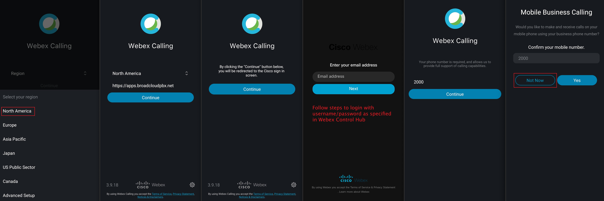

### Overview of the lab:
In this Lab, we will explore the different sections and some useful options of the Agent Desktop. You will watch a demo video about Agent Desktop overview and you will configure some options by following the described steps. At the end of the lab, you should be able to know where to find the different features and customize your own desktop layout.

# Table of Contents

- [1. Access to the Agent Desktop](#part-1-access-to-the-agent-desktop)
  * [1. Activate Webex Calling](#1-activate-webex-calling)
  * [2. Download and Login in the Webex Calling app for PC or Mac](#2-download-and-login-in-the-webex-calling-app-for-pc-or-mac)
  * [3. Download and Login in the Webex Calling app for mobile](#3-download-and-login-in-the-webex-calling-app-for-mobile)
  * [4. Login in the Agent Desktop](#4-login-in-the-agent-desktop)
- [2. Agent Desktop Overview](#part-2-agent-desktop-overview)
  * [1. Introducing the Agent Desktop Interface](#1-introducing-the-agent-desktop-interface)
  * [2. Verification of understanding](#2-verification-of-understanding)
- [3. Configure the User Profile](#part-3-configure-the-user-profile)
  * [1. Change Notifications setting and volume](#1-change-notifications-setting-and-volume)
  * [2. Switch to Dark Mode](#2-switch-to-dark-mode)
  * [3. See the list of the keyboard shortcuts](#3-see-the-list-of-the-keyboard-shortcuts)
  * [4. Download Error Report](#4-download-error-report)
- [4. Custom Desktop Layout](#part-4-custom-desktop-layout)
  * [1. Download default desktop Layout](#1-download-default-desktop-layout)
  * [2. Customize default desktop layout with logo and title](#2-customize-default-desktop-layout-with-logo-and-title)
  * [3. Upload the custom desktop layout and associate it to a team](#3-upload-the-custom-desktop-layout-and-associate-it-to-a-team)
  * [4. Verify the new custom desktop layout](#4-verify-the-new-custom-desktop-layout)
  * [5. More advance example](#5-more-advance-example)
- [5. Configuring Outdial](#part-5-configuring-outdial)
  * [1. Verify/create the Outdial Entry Point and Queue](#1-verifycreate-the-outdial-entry-point-and-queue)
  * [2. Test Outdial](#2-test-outdial)

# Introduction

### Lab Objective

The objective of this lab is to **explore the New Agent Desktop**, in order to be familiar with the new structure, learn about recently released features and be able to configure basic functionalities.

### Pre-requisites

- You need 2 devices where you can install webex calling (example: PC or Mac and Mobile).
- For doing this lab, you must first complete the **[Lab 1: Control Hub and Admin Portal](lab1.md)**:
   - You have the administrator's access to the Tenant Portal.
   - Agent created and configured.
   - Agent is part of 2 Teams.
   - Webex Calling extensions are assigned to a WxCC users (agent and supervisor).

### Quick Links

> Control hub: **[https://admin.webex.com](https://admin.webex.com){:target="_blank"}**\
> Portal: **[https://portal.wxcc-us1.cisco.com/portal](https://portal.wxcc-us1.cisco.com/portal){:target="_blank"}**\
> Agent Desktop: **[https://desktop.wxcc-us1.cisco.com](https://desktop.wxcc-us1.cisco.com){:target="_blank"}**

# Lab Section

## Part 1: Access to the Agent Desktop

>The following video explains the process to access the Agent Desktop. Following the steps, you will login with your credentials and indicate the number where you want to receive the calls. 

<iframe width="1024" height="576" src="https://www.youtube-nocookie.com/embed/dUYcMI0bsuU?rel=0" title="WxCC Lab #2 Part 1: Access to the Agent Desktop" frameborder="0" allow="accelerometer; autoplay; clipboard-write; encrypted-media; gyroscope; picture-in-picture" allowfullscreen></iframe>

---

### 1. Activate Webex Calling

- Login the **[Control Hub](https://admin.webex.com/){:target="_blank"}** with your admin credentials

- Navigate to **_Users_**

- Select the **Agent** user `agent1_<ID>@mailinator.com` created in the previus lab

- Make sure that you have activated **Webex Teams, Webex Calling (Enterprise) and Contact Center** services

- Scroll down to **_Calling Behaviour_** and select **_Webex Calling App_**

- Repeat the same steps for you **Supervisor** user `supervisor1_<ID>@mailinator.com`

### 2. Download and Login in the Webex Calling app for PC or Mac

- Login to **[https://settings.webex.com/](https://settings.webex.com/){:target="_blank"}**

- Click on **_Webex Calling_** this will cross launch CUP in a new browser tab

- Go to **_My Apps_**

- **Download** the Webex Calling Desktop App

- Open Webex Calling and **login** 

- Check the **_Sign-in with system browser_** option

- Go to **_File >  Edit Server Address**_ and choose **North America**

### 3. Download and Login in the Webex Calling app for mobile 

> **Note:** You need two Webex Calling app for placing a call to Entry Point and accepting on the agent side. Alternatively, if you have a US number, you can use it from the agent's desktop. This tenant does not allow numbers outside of the United States.

- Open your app manager (**Play Store or AppStore**) in your mobile

- Search for **_Webex Calling_**

- **Download** the app

- Login in the app with the **Supervisor user credentials**

### 4. Login in the Agent Desktop

- Navigate to **[https://desktop.wxcc-us1.cisco.com/](https://desktop.wxcc-us1.cisco.com/){:target="_blank"}** in a new browser tab

- Enter the agent’s **Username** `agent1_<ID>@mailinator.com` which you created in the previous lab.

- Enter the **Password** for the appropriate Username

- In the Station Login pane, select **"Extension"** and input the configured number for that user. 

> **Note:** Please use Extension for this lab. Alternatively, if you have a US number, you can use it from the agent's desktop. This tenant does not allow numbers outside of the United States.

- Select the `Team1_wxcclab_<ID>`, with default layout

- Click **_Submit_**. Make sure that you are successfully logged in to the Agent Desktop. Now you can continue with the next section.

## Part 2: Agent Desktop Overview
> Watch the following video, where each of the sections and their main options are explained. You will get a better idea of how the Agent Desktop look like and how to use it.

<iframe width="1024" height="576" src="https://www.youtube-nocookie.com/embed/6PhY8Wl_8Rw?rel=0" title="WxCC Lab #2 Part 2: Agent Desktop Overview" frameborder="0" allow="accelerometer; autoplay; clipboard-write; encrypted-media; gyroscope; picture-in-picture" allowfullscreen></iframe>

---

### 1. Introducing the Agent Desktop Interface

> **Note:** In this section you don't need to do anny tasks. This section was created to familiarize you with the agent interface.

The Agent Desktop is divided in 6 sections. In the image above you can see a general view of the Agent Desktop and where each section is located. We explain them all shortly:
1. **Task List**: When a request is routed to your queue and you are _Available_, a new request appears in your Task List pane. You must accept the requests to start communication with the customer.
2. **Horizontal Header**: Basic functionalities such as: Title and logo, Agent availability state, Notification Center, Outbound Call and User Profile. We will explain more in detail some User Profile options in the next section of the lab.
3. **Interaction Control**: When you accept a voice call (inbound or outbound), by default, the Interaction Control pane is expanded. This pane includes: customer information (CAD variables), timers (for example: connected and call on hold time) and call control buttons (Record, Hold, Transfer...).
4. **Auxiliary Information**: This section only appears when you accept an email, chat or social messaging conversation request, not for Voice requests. The center pane displays details based on your selection of the contact card in the Task List panel.
5. **Agent Interaction History**: You can view your previous communications with a customer across all the channels (voice, email, chat, and social) in this pane. The pane displays details for the last 24 hours.
6. **Navigation bar**: By default you can find the following icons here: Home, Agent Performance Statistics and Help. However, you can customize it and add some additional icons and widgets.

### 2. Verification of understanding

Finally, in order to make sure that you have understood the basic concepts, we ask you to **complete the following tasks**:

- Verify that Agent can see reports by clicking on **Agent Performance Statistic**

- Open the Agent Dekstop User Guide by clicking on **Help** button

## Part 3: Configure the User Profile

> The following video explains the steps you need to follow in order to configure some basic, but really useful, user profile related options in the Agent Desktop.

<iframe width="1024" height="576" src="https://www.youtube-nocookie.com/embed/3ZrPeIBE-HA?rel=0" title="WxCC Lab #2 Part 3: Configure the User Profile" frameborder="0" allow="accelerometer; autoplay; clipboard-write; encrypted-media; gyroscope; picture-in-picture" allowfullscreen></iframe>

---

### 1. Change Notifications setting and volume

- Click on **_User Settings_** in the upper right conner

- Scroll down to **_Notification Settings_**

- **Toggle** any of the 3 options to **enable or disable** different notifications

- Move the **Sound Volume** toggle bar

- You'll test this in the next lab.

- Check this when you receive a notification
		
### 2. Switch to Dark Mode

- Go again under **_User Settings_**

- Toggle the **_Switch to Dark Mode_** button to enable or disable it
		
### 3. See the list of the keyboard shortcuts

- Scroll down to **_Help_**

- Click on **_Keyboard Shortcuts_** or press **Ctrl+Alt+F**

- **See the list** of the keyboard shortcuts

- Find and test the combination to make the Agent status **_'Available'_**
		
### 4. Download Error Report

- Use a **_Keyboard Shortcuts_** and press **Ctrl+Shift+2** or click on **_User Settings_** in the upper right conner and scroll down to **_Download Error Repor_**

- Open the downloaded **error reports** file in your machine

## Part 4: Custom Desktop Layout

> Watch the following video to learn the dekstop layout customization process. After the video, you will be able to customize the Agent Desktop with your company logo and you will see a more advanced and cool layout example.

<iframe width="1024" height="576" src="https://www.youtube-nocookie.com/embed/Olrifma7Khc?rel=0" title="WxCC Lab #2 Part 4: Custom Desktop Layout" frameborder="0" allow="accelerometer; autoplay; clipboard-write; encrypted-media; gyroscope; picture-in-picture" allowfullscreen></iframe>

---

### 1. Download default desktop Layout

- Login to **[https://portal.wxcc-us1.cisco.com](https://portal.wxcc-us1.cisco.com){:target="_blank"}** with admin credentials​

- Navigate to **_Provisioning_** –> **_Desktop Layout_**

- Click on ellipses `...` of Global Layout and select **_Edit_**

- Click on **_Download_** button to download the **Default Desktop Layout.json** file

### 2. Customize default desktop layout with logo and title

- Open the **Default Desktop Layout.json** file with any text editor (e.g. Notepad or Sublime text)

- Modify the **_appTitle_** key value with your company name in order to change Agent Desktop title

- Modify the **_logo_** key value with your company logo URL or use this CiscoLive logo url: **https://raw.githubusercontent.com/wxcctechsummit/holcct2100/main/labslive/CiscoLiveLogo.jpg**

- **_Save As_** the JSON file with a distinguishable name

### 3. Upload the custom desktop layout and associate it to a team

- Go again to **_Desktop Layout_** module in the **[Tenant Portal](https://portal.wxcc-us1.cisco.com){:target="_blank"}**

- Click on **_New Layout_**

- Provide the preferable **name** `Desktop Layout <ID>`. Your \<ID\> is provided in the email in the **"Attendee ID"** line.

- Select `Team2_wxcclab_<ID>` as Team

- Click **_Upload_** button to upload the modified JSON file	

- Click **_Save_** button to apply the layout.

### 4. Verify the new custom desktop layout

- Login in the **[Agent Desktop](https://desktop.wxcc-us1.cisco.com/){:target="_blank"}**

- Open the **_User Profile_** and click on the arrow `>` under **_Team_**

- Change the team of the agent to `Team2_wxcclab_<ID>`

- Click on **_Save Team Selection_**

- **Confirm** the changes

- **Wait** some seconds to see the result

### 5. More advance example

- Download the JSON file from **https://cisco.box.com/s/4hmozg4h9gwaa1x9zhq1w6mehw8guvuy**

- Go again to **_Desktop Layout_** module in the **[Tenant Portal](https://portal.wxcc-us1.cisco.com){:target="_blank"}**

- Click on **_New Layout_**

- Provide any preferable **name and description** 

- Select `Team1_wxcclab_<ID>` again as Team	

- Click **_Upload_** button to upload the modified JSON file

- Click **_Save_** button to apply the layout.

- Login in the **[Agent Desktop](https://desktop.wxcc-us1.cisco.com/){:target="_blank"}** with the team `Team1_wxcclab_<ID>`

- **See** the new desktop layout

## Part 5: Configuring Outdial
> In the following video, all the required steps to configure and test an outbound call are explained. In order to complet it you will need to login in Webex Calling with the corresponding extension number of the agent.

<iframe width="1024" height="576" src="https://www.youtube-nocookie.com/embed/47DPXWs7H54?rel=0" title="WxCC Lab #2 Part 5: Configuring Outdial" frameborder="0" allow="accelerometer; autoplay; clipboard-write; encrypted-media; gyroscope; picture-in-picture" allowfullscreen></iframe>

---

### 1. Verify/create the Outdial Entry Point and Queue

- Login in the **[Tenant Portal](https://portal.wxcc-us1.cisco.com/portal){:target="_blank"}** 

- Navigate to **_Provisioning > Outdial Entry Point / Outdial Queue_**

- **Create a new Outdial Entry Point** called `EP_Outdial_<ID>` and set any Service Level Threshold. It will be automatically associated to `Outdial Queue-1`

- Go to **_Routing Strategy > Create new Routing Strategy** 

- Configure the outdial entry point routing strategy with the script **`Outdial_EP.js`**

- Ensure the strategy **time of day** setting is correctly **open 24x7** and marked as **_Default_**

- Navigate again to **_Provisioning > Outdial ANI > Create an Outdial ANI_** on the setup by mapping it to the existing toll free number

- Go to  in **_Provisioning > Address Book_** and add **+18005536387** Cisco Public Tollfree number in a **_New Address Book_**

- Go to **_Provisioning > Agent Profiles_** and edit the one called **_Agent-Profile_**

- Go to the **_Dial Plan_** tab

- Configure all the Outdial settings: Outdial Enabled, Outdial Entry Point as `EP_Outdial_<ID>`, Dial Plan Enabled (Any Format) and select the before created Outdial ANI

### 2. Test Outdial

- Login/Relogin in the **[Agent Desktop](https://desktop.wxcc-us1.cisco.com){:target="_blank"}** for the new agent profile settings to take effect

- You should now see the **Outdial button enabled**

- **Select the Outdial ANI** and test making a call to your cellphone number or the provided Cisco Public Tollfree number (**+18005536387**)

- You should **receive a call notification** in the Agent Desktop and your Webex Calling application ringing. If the call is established, you have successfully completed this lab.

## Congratulations, you are now ready to start the [Lab 3: IVR and Contact Routing](lab3.md)
